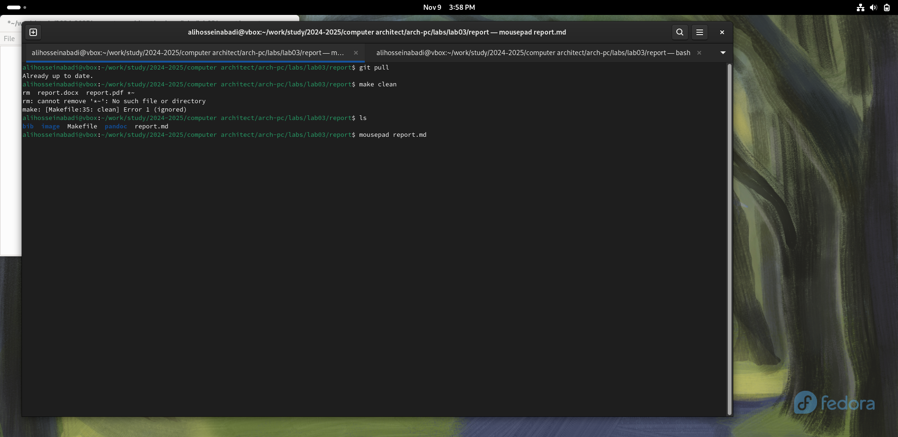

---
##Front matter
title: "Laboratory work report template"
subtitle: "discpipline: Computer Architecture"
author: "ali Hosseinabadi"

##Generic options
long: ru-RU
toc-title: "Content"

## Generic otions
lang: ru-RU
toc-title: "Content"

## Bibliography
bibliography: bib/cite.bib
csl: pandoc/csl/gost-r-7-0-5-2008-numeric.csl

## Pdf output format
toc: true # Table of contents
toc-depth: 2
lof: true # List of figures
lot: true # List of tables
fontsize: 12pt
linestretch: 1.5
papersize: a4
documentclass: scrreprt
## I18n polyglossia
polyglossia-lang:
  name: russian
  options:
	- spelling=modern
	- babelshorthands=true
polyglossia-otherlangs:
  name: english
## I18n babel
babel-lang: russian
babel-otherlangs: english
## Fonts
mainfont: IBM Plex Serif
romanfont: IBM Plex Serif
sansfont: IBM Plex Sans
monofont: IBM Plex Mono
mathfont: STIX Two Math
mainfontoptions: Ligatures=Common,Ligatures=TeX,Scale=0.94
romanfontoptions: Ligatures=Common,Ligatures=TeX,Scale=0.94
sansfontoptions: Ligatures=Common,Ligatures=TeX,Scale=MatchLowercase,Scale=0.94
monofontoptions: Scale=MatchLowercase,Scale=0.94,FakeStretch=0.9
mathfontoptions:
## Biblatex
biblatex: true
biblio-style: "gost-numeric"
biblatexoptions:
  - parentracker=true
  - backend=biber
  - hyperref=auto
  - language=auto
  - autolang=other*
  - citestyle=gost-numeric
## Pandoc-crossref LaTeX customization
figureTitle: "Pic."
tableTitle: "Таble"
listingTitle: "Listing"
lofTitle: "Illustration list"
lotTitle: "Table list"
lolTitle: "Listing"
## Misc options
indent: true
header-includes:
  - \usepackage{indentfirst}
  - \usepackage{float} # keep figures where there are in the text
  - \floatplacement{figure}{H} # keep figures where there are in the text
---

# Purpose of work

the goal of this lab is to learn how to format reports using lightweight markdown makeup language.
 
# Task

-installation of neceserry software

-filling in the laboratory work report no-3 using the markdown markup language

-task for independent work

# Theoretical introduction

Markdown is a lightweight markup language designed to designate formatting in plain text, with maximum human readability, and suitable for machine conversion into languages for advanced publications (HTML, Rich Text and others).

# Laboratory work

In the terminal, I go to the course directory and update the repository from the remote one to GitHub. (@fig:001)

{#fig:001 width=70%} 

I compile the template using the make command (fig:002), check the correct execution of the command using the ls command (@fig:003) 

{#fig:002 width=70%} 

{#fig:003 width=70%} 

After checking the functionality of the template compiler, I delete the generated files using the make clean command (@fig:004) 

{#fig:004 width=70%} 

Using the editor, I run a report on the completed laboratory work (@fig:005)

{#fig:005 width=70%}

# Tasks for independent work

Similarly to completing the report on the current lab, I complete the report in markdown for the second lab, for this I go to the directory of the 2nd lab and prepare the report using the mousepad text editor. (@fig:006)

{#fig:006 width=70%}

# Conclusions

As a result of completing this lab, I mastered the procedures for preparing reports using the lightweight markup language Markdown.

# References

1. [Course on TUIS](https://esystem.rudn.ru/course/view.php?id=112)
2. [Laboratory work No. 3](https://esystem.rudn.ru/pluginfile.php/2089083/mod_resource/content/0/%D0%9B%D0%B0%D0%B1%D0%BE%D1%80%D0%B0%D1%82%D0%BE%D1%80%D0%BD%D0%B0%D1%8F%20%D1%80%D0 %B0%D0%B1%D0%BE%D1%82%D0%B0%20%E2%84%963.%20%D0%AF%D0%B7%D1%8B%D0%BA%20%D1%80%D0%B0%D0%B7%D0%BC%D0%B5%D1%82%D0%BA%D0%B8%20.pdf) 3 . [Example of lab work](https://github.com/evdvorkina/study_2022-2023_arh-pc/blob/master/labs/lab04/report/%D0%9B04_%D0%94%D0%B2%D0%BE%D1%80%D0%BA%D0%B8%D0%BD%D0%B0_%D0%BE%D1%82%D1%87%D0%B5%D1%82.md?plain=1)